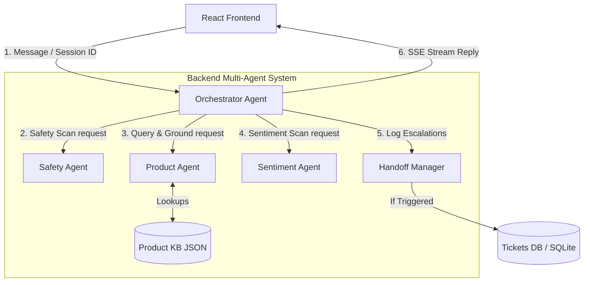

# Implementation Plan - P&G Customer Support Chat Assistant (Multi-Agent System)

This plan outlines the architecture, design, and step-by-step build order for the P&G Customer Support Chat Assistant, designed as a **Multi-Agent backend system**.

## Architectural Overview

We will implement a web application featuring a **Python (FastAPI) backend** and a **React/Vite frontend** (with Vanilla CSS). The backend will employ a multi-agent collaboration model:



### Key Technical Decisions
1. **Multi-Agent Design**:
   - **Safety Agent**: Solely responsible for identifying physical safety risks, ingestion, allergic reactions, or injuries. Runs a highly specific binary classification and gives general advice recommendations.
   - **Product/Knowledge Agent**: Responsible for querying the knowledge base, planning product searches, and validating that facts are strictly grounded in official files.
   - **Sentiment Agent**: Solely responsible for classifying user emotion (calm, annoyed, angry, etc.).
   - **Orchestrator Agent**: Manages conversation history, triggers execution of sub-agents concurrently or sequentially, aggregates their decisions, decides on human hand-offs, and handles the streaming of final output.
2. **Model & API**: We will use the Google Gen AI SDK (`google-genai`) to interact with Gemini models (e.g., `gemini-2.5-flash` or `gemini-1.5-flash`). We will also build a robust fallback/mock service that simulates agent logic if `GEMINI_API_KEY` is not configured, allowing the application to run out-of-the-box.
3. **Product Knowledge Base**: A structured JSON database (`products.json`) containing official ingredients, safety guidelines, and purchase links for major brands (Tide, Pampers, Olay, Gillette).
4. **Database**: A lightweight SQLite database (`sqlite3` / `aiosqlite`) to persist conversation history and human escalation logs.
5. **Streaming & Progress**: Server-Sent Events (SSE) using FastAPI's built-in `StreamingResponse` to send progress events (e.g., `"Safety Agent scanning message..."`, `"Product Agent retrieving data..."`) followed by the streamed text content.
6. **Session Management**: Session IDs generated on the client, saved in `localStorage`, and passed in the `X-Session-ID` header.

---

## The Multi-Agent Pipeline

Every incoming message runs through the following sequence on the backend:

1. **Step 1 - Safety Agent Check**: Run a classification prompt checking for injury, allergic reaction, swallowing, or chemical exposure. This is a binary check independent of emotional tone.
2. **Step 2 - Product Agent Intent & Knowledge Query**: Retrieve matching product data from the official knowledge base using keyword/semantic search.
3. **Step 3 - Product Agent Factual Grounding**: Filter and structure the retrieved official facts. The Product Agent validates that all proposed facts are strictly present in the retrieved set.
4. **Step 4 - Sentiment Agent Check**: Assess the message's emotional tone (e.g., `calm`, `annoyed`, `furious`).
5. **Step 5 - Orchestrator Handoff Decision**: If the Safety Agent triggered safety warnings OR the Sentiment Agent detected strong negative emotions, mark the session for human hand-off.
6. **Step 6 - Handoff Logging**: If hand-off is required, log a ticket to the SQLite database with the session ID, conversation snapshot, trigger reason, and urgency level.
7. **Step 7 - Orchestrator Response Generation**: Generate the final message using a prompt that combines:
   - The user's input
   - Grounded product facts from the Product Agent
   - Safety status and general guidance from the Safety Agent
   - Apologetic adjustment based on the Sentiment Agent's assessment
   - Clear escalation message: "I've flagged this for a human support agent who will follow up"
8. **Step 8 - Conversation Persistence**: Append the message and assistant's response to the conversation history database.
9. **Step 9 - Streaming Delivery**: Send progress states of individual agents to the client via SSE, then stream the final response word-by-word.

---

## Build Order (Phase-by-Phase)

We will follow the exact build order specified in the brief.

### Phase 1: Core Engine & Logical Isolation
**Goal**: Verify reasoning, safety classification, and tone detection in isolation.
- Create a test script (`pytest tests/test_engine.py`) that feeds sample messages (calm safety reports, angry complaints, standard queries) to the engine and asserts the correct flags are raised.
- Files:
  - `server/src/agents/safety_agent.py` (Step 1 Safety Scan)
  - `server/src/agents/product_agent.py` (Step 2 & 3 Query, Grounding)
  - `server/src/agents/sentiment_agent.py` (Step 4 Tone Detection)
  - `server/src/agents/orchestrator_agent.py` (Step 5-7 Coordination & Response)
  - `server/src/services/llm_service.py` (Wrapper for Gemini API or fallback mock)

### Phase 2: Durability & Storage
**Goal**: Confirm conversation and hand-off storage survives restarts.
- Set up SQLite schema for `conversations` and `tickets`.
- Create a storage service.
- Create a test script (`pytest tests/test_storage.py`) that writes conversations, restarts the process, reads them back, and verifies they are identical.
- Files:
  - `server/src/services/db_service.py`

### Phase 3: Engine + Storage Integration
**Goal**: Combine the core engine and database.
- Integrate the pipeline so that incoming messages load history, run the engine, and save new turns.
- Create a test script (`pytest tests/test_integration.py`) to verify that safety escalations properly write ticket records to the DB and update conversation tables.

### Phase 4: Streaming & Progress (SSE)
**Goal**: Build the real-time SSE endpoint.
- Implement a FastAPI route `/api/chat` that accepts messages and session IDs, and streams responses.
- It must stream structured JSON events (e.g., `event: progress, data: "Checking safety..."` and `event: chunk, data: "Hello..."`).
- Verify streaming works correctly using `curl` or a test script.

### Phase 5: Frontend UI
**Goal**: Build a premium, responsive, glassmorphic UI.
- Home page with brand-themed accent colors (P&G blue, Olay gold, Pampers teal).
- Stream messages character-by-character.
- Show active step indicator (e.g., "Searching Pampers products...", "Safety scan complete").
- Floating notification banner when a conversation has been escalated to a human.
- Automatic session restoration on reload.
- Ticket management view (accessible at `/admin` or `/tickets`) to view human hand-off logs for testing and verification.

---

## Proposed Folder Structure

We will create a new workspace folder `pg-support-assistant` under the default scratch directory:
`C:\Users\AJRishab\.gemini\antigravity\scratch\pg-support-assistant`.

```
pg-support-assistant/
├── server/
│   ├── src/
│   │   ├── config/
│   │   │   └── products.json      # Structured product information
│   │   ├── agents/
│   │   │   ├── orchestrator_agent.py # Coordinates agent executions, handles escalations
│   │   │   ├── safety_agent.py       # Performs safety scan
│   │   │   ├── product_agent.py      # Searches and grounds product facts
│   │   │   └── sentiment_agent.py    # Determines customer emotion
│   │   ├── services/
│   │   │   ├── db_service.py      # SQLite session & ticket database
│   │   │   └── llm_service.py     # Gemini API connection / Mock
│   │   └── main.py                # FastAPI application with SSE
│   ├── tests/                     # Validation scripts for Phase 1-4
│   │   ├── test_engine.py
│   │   ├── test_storage.py
│   │   └── test_integration.py
│   └── requirements.txt           # FastAPI, uvicorn, google-genai, aiosqlite, pytest
├── client/
│   ├── src/
│   │   ├── components/            # UI components
│   │   ├── index.css              # Custom CSS variables, dark mode, glassmorphism
│   │   ├── App.jsx
│   │   └── main.jsx
│   ├── index.html
│   └── vite.config.js
└── README.md
```

---

## User Review Required

> [!IMPORTANT]
> - **API Configuration**: To call the actual Gemini API, you will need to set the `GEMINI_API_KEY` environment variable. If not set, the application will use a rule-based mock engine that demonstrates the exact safety, tone, search, and hand-off behaviors.
> - **Workspace Configuration**: We will set up the project under `C:\Users\AJRishab\.gemini\antigravity\scratch\pg-support-assistant`. Once created, we recommend opening this folder in your IDE.

## Open Questions

None at this time. The product brief is highly detailed and specific.

---

## Verification Plan

### Automated Verification
We will write automated test files for the first four phases:
1. `npm run test:engine`: Verifies isolated logic for safety triggers, product lookup, and tone.
2. `npm run test:storage`: Verifies SQLite read/write persistence across simulation restarts.
3. `npm run test:integration`: Verifies database integration with the pipeline.

### Manual Verification
- Deploying the app locally using `npm run dev`.
- Simulating a safety event (e.g., "My toddler swallowed some Tide pods") and verifying:
  - Immediate visible notification that a human is following up.
  - The ticket logged in the ticket dashboard.
  - General safety instructions provided, with no medical diagnosis.
- Simulating customer frustration (e.g., "This Gillette shaver is horrible, I'm going to sue you") and verifying:
  - The tone shifts to be apologetic.
  - Hand-off is triggered and a human is flagged.
- Refreshing the browser mid-chat to verify session persistence.
